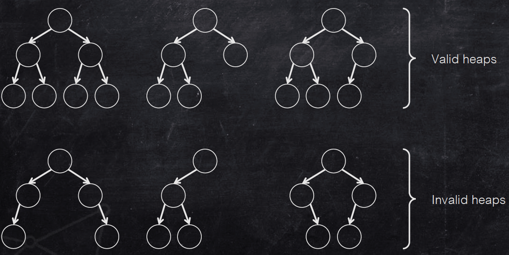
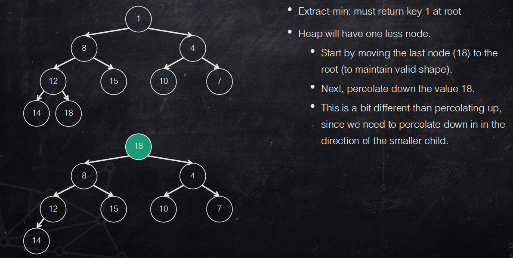
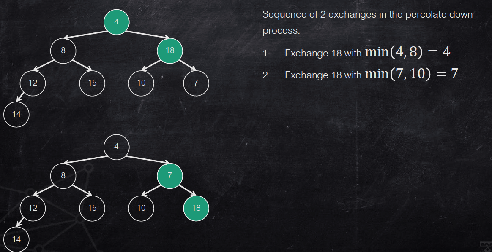
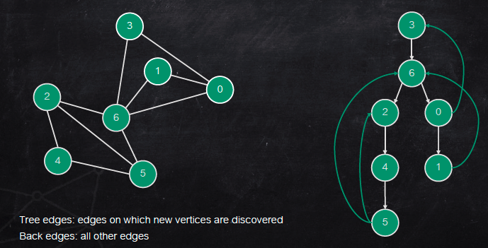
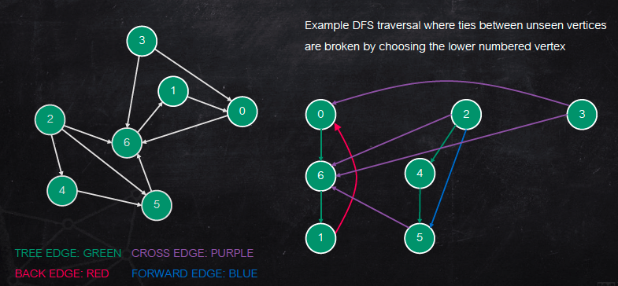
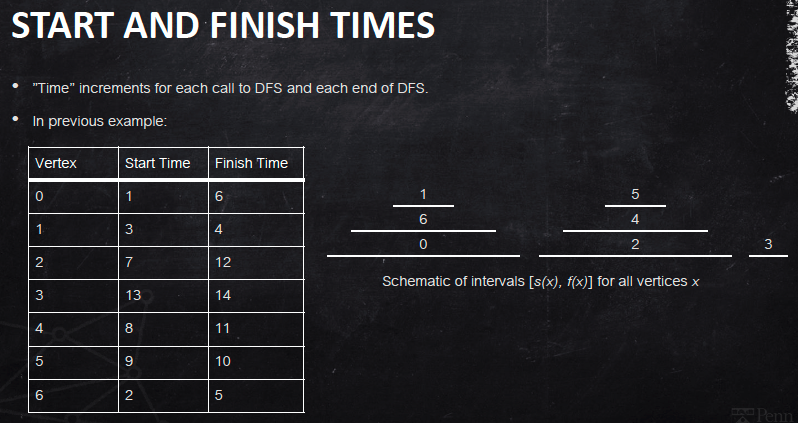
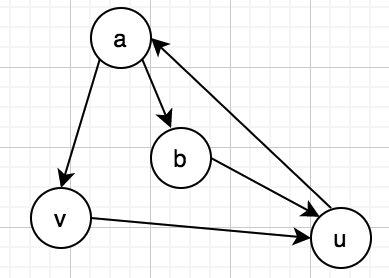

**Algorithms**<br>
Course Structure: @ Prof. Sampath Kannan, Prof. Arvind Bhusnurmath from University of Pennsylvania<br>
Additional Content: @ Prof. Bob Sedgewick, Prof. Kevin Wayne from Princeton University<br>
```Java
@ Note by Puran Zhang
```

- Create and analyze the paradigms of divide-and-conquer, randomized algorithms, greedy algorithms, and dynamic programming
- Distinguish important and basic algorithms for sorting and selection and create new algorithms using these
- Describe basic graph algorithms, including network flow, and utilize them in solving new problems
- Differentiate the complexity classes P, NP, and NP-complete, and be able to show problems NP-complete

[Syllabus](https://d18ky98rnyall9.cloudfront.net/12rr2CVKSXKq69glSmly7A_cb4355cbe7c943ed8a75a072a6cbfaf1_CIT-596---Syllabus---Summer-2021_v2.pdf?Expires=1621296000&Signature=Ktp0kdZXxblgpDr4h5fbRC5OLhXHkICi~f-HxMMO4lMr7HQVJFXxbVCr8vYdotKPMC5EzdBStO6F~MEo-lYcLNSMvLACFiVP13LuBrvF-WmAFVUkogtrFoxo42ZLGCBLQrFwRyx-CAgAOkso3b0IJzbMGqyAF70Q-GPwEcPGqoY_&Key-Pair-Id=APKAJLTNE6QMUY6HBC5A)

- 14 Quick Quizzes: 10%
- 7 Individual Assignments: 55%
- Midterm 1 (M1-M5): 10%
- Midterm 2 (M6-M10): 10%
- Final (Cumulative, but more on M11-M14): 15%

Summary:
- Model of Computation 
    - Counting steps (M 1)
    - Asymptotics (M 1)
- Data Structures
    - Heaps, Hashing, Binary Search Trees (M 5)
    - Graphs (M 6)
- Algorithm Design Paradigms
    - Recursive (M 2)
    - Divide and conquer (M 3)
    - Randomized (M 4)
    - Greedy (M 7, 8)
    - Dynamic Programming (M 9, 10)
- Network Flows (M 11)
- Computation Complexity (M 12- 14)

## M1: Intro. Algorithms

The first module of this course begins by situating the study of algorithms on a mathematical base, supplemented by an interview with Professor Sanjeev Khanna. We use the example of creating a simple algorithm, and then improving upon it, to gain insight into foundational algorithm analysis. It also covers how we argue that algorithms are correct, emphasizing the course motto “Correctness first, then efficiency.” This module also overviews the logistics and policies for this course.

Learning Objectives
- Summarize the algorithms for max-subinterval sum.
- Analyze the running time of nested loop code fragments.
- Explain how to use asymptotic 渐进 notation and asymptotic analysis.

Mathematical point of view: **Designing algorithms for general problems**

### Model of Computation
Asymptotics: Growth rate of functions without regard to constants

* Worst-case complexity：growth rate of function $f(n)$ is max time (counting steps) algorithm takes on any input of length n
* **Big-Oh** $O$: $\leq$ upper bound 
    * $f(𝑛) = O(g(n))$ if $f(𝑛) \leq k g(n)$ for $n \geq n_0$ for constants $k, n_0$
    * $f(n)$ grows no faster than $g(n)$
    * **Little-oh <**: $lim_{n \rightarrow \infty}  \frac{f(n)}{g(n)}=0$ Stronger
        * $log(n)= o(n)$<br>
        $lim_{n \rightarrow \infty} \frac{log(n)}{n}= lim_{n \rightarrow \infty} \frac{1/n}{1}=0$
* **Big-Omega** $\Omega$: $\geq$ lower bound
    * $g(𝑛) = \Omega(f(n))$ if $g(𝑛) \geq k f(n)$ for $n \geq n_0$ for constants $k, n_0$
    * $g(n)$ grows no slower than $f(n)$
    * ! Lower bounds are also for the worst case!
* **Big-Theta** $\Theta$ **tight bound**:
    * If we have an upper bound $f(n)$ and lower bound $g(n)$ on an algorithm’s running time and $f(n)=O(g(n))$ then we have a tight bound, We say the algorithm runs in time $\theta(f(n))$ in this case
    * $f(n)= \theta(g(n))$ if $k_1g(n) \leq f(n) \leq k_2g(n)$
    
 
**Increasing order of asymptotic complexity:**<br>
$c < ln(n) = log(n^5)< (log n )^5 < \sqrt{n} < log(2^n) = n < nloglogn < log(n!) = nlog(n)< nlog^2n< n^{1.5}  < 2^n = 2^{n+1} < 3^n< 2^{2n}$


Proof:<br>
As we know $n!> e^n$ (n items, for most item of $n!$ is always bigger than e), then $log(n!)> log(e^n)= n$<br>
$\because log(n!)= log1 + \cdots + logn \leq log(n^n)= n  \cdot log(n) \therefore log(n!) \leq nlogn$<br>
$\because log(1) + ... log(n/2)+ ... + log(n) \geq log(n/2)+ ... + log(n) \geq log(n/2) + ... log(n/2) = \frac{n}{2}\cdot log(n/2)$<br>
$\therefore \frac{n}{2}\cdot log(n/2) \leq log(n!) \leq nlogn$<br>
By Squeeze Theorem, $log(n!) = nlog(n)$

By L Hopital's rule, $ lim_{n \rightarrow \infty} \frac{\sqrt{n}}{log(2^n)}= lim_{n \rightarrow \infty} \frac{1}{2 \sqrt{n} nln(2)}< 1$, we get $ \sqrt{n} < log(2^n)$

### Find Subinterval of Maximum Sum
Given a one dimensional array that may contain both positive and negative integers, find the sum of contiguous subarray of numbers which has the largest sum.

* Naive method: To run two loops. The outer loop picks the beginning element, the inner loop finds the maximum possible sum with first element picked by outer loop and compares this maximum with the overall maximum. Finally return the overall maximum. The time complexity of the Naive method is $O(n^2)$.
```Java
bestSum = 0
for i = 1 to n
    for j = i to n
        currSum = 0
        for k = i to j
            currSum += A[k]
            if currSum > bestSum
                bestSum = currSum
```

**Find the best summing interval ending in index k**

Max[A[k], 0, Best(k-1) + A[k]] = Best(k) # 0: empty interval

```Java
BestArray = 0
for i=1 to n
    Best(i) = max(A[k], 0, Best(i-1) + A[i])
    
return max Best(i)
```

* The best divide-and-conquer algorithm for the maximum-sum-subinterval selection problem takes time $Θ(n log n)$. Does it follow that a lower bound for this problem is $Ω(n log n)$. Justify your answer.
    * Just because one particular algorithm has a lower bound of Ω(n log n) it doesn’t follow that this is a lower bound for the problem. In fact, we have seen another algorithm that solves the problem in $O(n)$ time; so $Ω(n log n)$ cannot be a lower bound.

### Leetcode
#### 53 Maximum Subarray

#### 309 Best Time to buy and sell stock with Cooldown


## M2: Designing Algorithms inductively and recursively

Module 2 introduces summing series, a useful tool throughout the course, and two examples that illustrate the main ways of designing algorithms, InsertionSort and Towers of Hanoi. InsertionSort is an algorithm that results from thinking inductively, while Towers of Hanoi illustrates thinking recursively. We go over how to solve the “recurrence relation” that governs the running time of a recursive algorithm. Finally, the module covers Euclid’s classic algorithm for computing GCD (greatest common divisor.)

Learning Objectives
- Apply computing sums of series.
- Explain the Insertion Sort algorithm and its analysis.
- Explain the Towers of Hanoi algorithm and its analysis.
- Examine Euclid's algorithm for finding the GCD.

### Seires Basics

$\sum^n_{i=1} i^2 = \frac{n(n+1)(2n+1)}{6}$

- **Arithmetic series**: The series consists of the n elements: $a, a + d, a + 2d, . . . a + (n − 1)d$
    - $\sum^{n-1}_{i=0} (a+id) = an + d \sum^{n-1}_{i=0}i = an + \frac{dn(n-1)}{2}$
- **Geometric series**: The n terms in the series are $a, ar, ar^2, . . . ar^{n−1}$
    - $\sum^{n-1}_{i=0} ar^{n-1} = \frac{a(1-r^n)}{1-r}$
- **Harmonic 调和 series**: 
    - $\sum^{n}_{i=1} \frac{1}{i}$

**Count steps**

Counting steps for for loops is pretty easy:
```Java
for 𝑖 = 1 to 𝑛 //Single loop
```
Executed 𝑛 times...<br>
Running time: 𝑛 x (time per iteration)<br>
Execution time… if computation inside loop is $𝑂(1)... =𝑂(𝑛)$<br>

Nested loop:
```Java
for 𝑖 = 1 to n //Nested loop
    for 𝑗 = 𝑖 to 𝑛
```
Inner loop executed: $(𝑛−𝑖+1)$ times<br>
Execution time… if $𝑂(1)$ work inside loop:<br>
$\sum_{i=1}^𝑛 n-i+1 = \sum_{𝑖=1}^𝑛 𝑖 = \frac{n(𝑛+1)}{2}= 𝑂(𝑛^2)$

Time complecity of the following: $\Theta(n logn)$
```Java
int k = 0;
    for (int i = n / 2; i <= n; i++) {
        for (int j = 2; j <= n; j = j * 2) {
            k = k + n / 2;
        }
    }
```

**Insertion sort**

Great example of algorithm design by induction (on number of iterations)
```Java
for 𝑖=1 to length(A) -1:
    𝑗= 𝑖
    while 𝑗 > 0 & 𝐴[𝑗−1] > 𝐴[𝑗]:
        swap 𝐴[𝑗] & 𝐴[𝑗−1]
        𝑗 = 𝑗 −1
```

Worst case happens when 𝐴 is in reverse order. Worst-case running time: $\sum^n_{i=1} i = 𝑂(𝑛^2)$

### Towers of Hanoi Algorithm 汉诺塔递归算法


Given n disks on peg A. The task is to move all n disks to peg C, one disk at a time, never putting a bigger disk on top of a smaller disk. We gave a recursive algorithm for the problem.

$T(n):$ number of operations for tower with n disks.<br>
* algorithm on n disks
    * first move n-1 disks to peg B with help of C: $T(n-1)$ steps
    * Next move biggest to peg C: 1 step
    * Finally move n-1 disks to peeg C: $T(n-1)$ steps
* $T(n) = 2T(n-1)+1, T(1)=1$ if there is one edisk, we move it in 1 move
* $T(n) = 2^k T(n-k) + \sum^{k-1}_{i=0}2^i$

* Recursion is similar as strong induction

### GCD (greatest common divisor)
* Suppose $𝑎>𝑏$. If $𝑑=gcd(𝑎, 𝑏)$, then $𝑑=gcd(b, 𝑎−𝑏)$
* **Euclid's Algorithm**: a, b are n-bit binary numbers, time taken $T(n)= O(n)$
    * if $b > \frac{a}{2}$ then $r < a - b < \frac{a}{2}$; if $b < \frac{a}{2}$ then $r < b < \frac{a}{2}$
    * after 1 iteration r is at most half of a, in 2 nd iteration b plays role of a, both a, b are halved (at most n-1 bits)
    * $T(n) \leq 2 + T(n-1)$    
```Java
// a>b>0
while ((r= a mod b)>0){
    a = b;
    n = r;
}
return b
```
```Java
euclid(a, b):
    if b ==0:
        return a
    return euclid(b, a%b)
```
    * Prove that given a positive integer a and a non-negative integer b, the number d that Euclid’s algorithm outputs is in fact gcd(a, b).<br>
    Part 1. By definition, denote that $a= gcd(a, b)\times  p, b = gcd(a, b)\times q, p \in N^+, q \in N^+$<br>
    $a-b = (p-q) \times gcd(a, b)$<br>
    Therefore, $gcd(a, b)$ is the divisor of $a-b$.<br>
    Denote that $b = m \times gcd(b, a-b), a-b = n \times gcd(b, a-b)$<br>
    $a = (m+n) \times gcd(b, a-b)$<br>
    Therefore, $gcd(b, a-b)$ is the divisor of $a$.<br>
    As a is divisible by $gcd(a, b)$ and $gcd(b, a-b)$ and $gcd(a, b)$ is the greatest common divisor of a and b,<br> $gcd(a, b) \geq gcd(b, a-b)$<br>
As a-b is divisible by $gcd(a, b)$ and  $gcd(b, a-b)$ and $gcd(b, a-b)$ is is the greatest common divisor of b and a-b,<br>
$gcd(a, b) \leq gcd(b, a-b)$<br>
Therefore, $gcd(a, b) = gcd(b, a-b)$<br>
$gcd(a, b) = gcd(b, a-b)= gcd(b, a-2b) = ...= gcd(b, a \%b)$<br>
Thus, $gcd(a, b) = gcd(b, a \%b)$<br>
We prove that Euclid's algorithm outputs is in fact $\mathrm{gcd}(a,b)$.<br><br>
Part 2. Using the strong induction to prove that given a  positive integer $a$ and a non-negative integer $b$, the number $d$ that Euclid's algorithm outputs is in fact $\mathrm{gcd}(a,b)$.<br>
BC: For $\forall a > 0,$ when $b = 0, euclid(a, b)= a$. a is in fact $gcd(a, 0)$. By definition of 0, a is a factor of 0.<br>
IH: Assume that for $\forall a > 0, n \in N^+, \forall b \leq n,  euclid(a, b) =gcd(a, b)$<br>
IS: For $b = n+1, a\%b < b= n+1,$ so $a\%b \leq n$, using IH, euclid algorithm,$ gcd(a, b) = gcd(b, a \%b)$<br>
$euclid(a, b) = euclid(b, a \%b) = gcd(b, a\%b)= gcd(a, b)$<br>
In conclusion, we proved that given a  positive integer $a$ and a non-negative integer $b$, the number $d$ that Euclid's algorithm outputs is in fact $\mathrm{gcd}(a,b)$.<br>


* Extended GCD: Euclid's Algorithm can also be used to find integers 𝑥 and 𝑦 such that $ax + by = gcd(a, b)$
     * gcd(74, 44): $30=1*74+(−1)*44, 14=44–30=1*44–(1*74+(−1)*44)=2*44+(−1)*74$<br>
        $2= 30–2*14=(1*74+(−1)*44)–2*(2*44+(−1)*74)=3*74+(−5)*44$

### Leetcode
#### 147 Insertion Sort List

#### 1071 Greatest Common Divisor of Strings

## M3: Divide-and-Conquer Algorithms

This module introduces “divide-and-conquer 征服” 分而治之 algorithms, which break up the problem you want to solve into “divide,” “conquer,” and “combine” steps. It illustrates a real use of this paradigm using the MergeSort algorithm. This module also covers how to solve recurrence relations, and proves the Master Theorem. Finally, this module introduces a useful variation of the divide-and-conquer paradigm, often referred to as "decrease-and-conquer" where at each step you generate only one subproblem.

Learning Objectives
- Describe the MergeSort algorithm.
- Use the Master Theorem for solving recurrences.
- Create Divide-and-Conquer algorithms for new problems.
- Inspect the runtime of divide-and-conquer algorithms.

Read Chapter 5, in particular Sections 5.1 and 5.2, plus merging analysis from section 2.4, of the course textbook Algorithm Design by Kleinberg and Tardos.

MergeSort - 5.1, 2.4

Solving Recurrence Relations - 5.2, plus CLRS 4.4-4.5


### Divide and Conquer Paradigm: MergeSort
Divide and Conquer Paradigm
- Break input into roughly equal halves (Divide)
- Solve the problem in each of the halves (Conquer)
- Put together solution to the whole problem (Combine)

**Merge sort**: $O(logn)$
- Split input array into two halves
- Sort each half separately
- Combine the sorted arrays


* Merging 2 Sorted Lists
    * Input: two sorted arrays of size 𝑛 and 𝑚, Output: a single sorted array of size n+m
    * Each comparison places one input, Steps =𝑂(𝑚+𝑛)

MergeSort Pseudocode
```Java
merge(A, B):
    C = new array[len(A) + len(B)]
    i, j, k <- 0
    while i < len(A) and j < len(B):
        if A[i] < B[j]:
            C[k] <- A[i]
            i++, k++
        else:
            C[k] <- B[j]
            j++, k++
    while i < len(A):
        C[k++] <-A[i++]
    while j < len(B):
        C[k++] <- B[j++]
    return C
```
Merge Sort is a recursive 递归 algorithm
```Java
MergeSort(A)
    rec-mergesort(A, 0,len(A)-1)//index low, high
    
rec-mergesort(A, lo, hi):
    if (hi - lo <= 0) return //arrays od size 1 or empty
    mid = (lo + hi) / 2
    rec-mergesort(A, lo, mid)
    rec-mergesort(A, mid+1,hi)
    C = merge(A[lo:mid],A[mid+1:hi])
    copy elements from C back into A
```

Base case: 
- Recursion bottoms out when we have arrays of length 1
- Such arrays are already sorted. So $𝑇(1) = 0$
- Array of length 2 leads to two recursive calls on arrays of length 1
- These calls return immediately and then we “merge” the two sorted arrays of length 1
    - Merge takes one step.
    
Analyzing merge sort: Recurrence relations
* Let $𝑇(𝑛)$ be the time for mergesort to sort a list of n elements
* What are the steps going into $𝑇(𝑛)$?
    - Divide: 0 steps
    - Conquer: need to sort 2 arrays of length 𝑛/2 each: ≤ 2𝑇(𝑛/2) steps
    - Combine: merge 2 sorted lists of length 𝑛/2 each: ≤ 𝑛 steps
    
$$T(n) \leq 2T(\frac{n}{2})+ n$$
$$T(1)=0$$

- We can represent the quantities involved by a tree:
    - Each node is labeled with the size of the problem being solved
    - Each level is labeled with the number of steps (excluding recursive calls)
    - Total running time of the algorithm is the sum of all the steps in each level
    


### Master Theorem

Let $T(n)$ be a monotonically increasing function that satisfies

$T(n)= aT(\frac{n}{b}) + f(n)$

$T(1) = d$

where $a \geq 1, b \geq 2, d> 0$. 

If $f(n) \in \Theta(n^c)$ where $c \geq 0$, then the recurence 

$T(n) \leq aT(\frac{n}{b}) + n^c$ has solution:

$T(n) = \Theta(n^c)$ if $a < b^c$

$T(n) = \Theta(n^c logn)$ if $a = b^c$

$T(n) = \Theta(n^{log_b^a})$ if $a > b^c$

You cannot use the Master Theorem if
* $T(n)$ is not monotone, ex: $T(n) = sin n$
* $f(b)$ is not a polynomial, ex: $T(n) = 2 T(\frac{n}{2}) + 2^n$
* $b$ cannot be expressed as a constant, ex: $T(n) = T(\sqrt{n})$

Note here, Master Theorem does not solve a recurrence relation.

**Corollary**

If $f(n) \in \Theta(n^{log_b^a} log^k n)$ for some $k \geq 0$ then $T(n) \in \Theta(n^{log_b^a} log^{k+1}n)$

**Understanding:**

$T(n) \leq aT(\frac{n}{b}) + n^c$

Root level: $n^c$ as addition <br>
Second level: $ a (\frac{n}{b})^c = \frac{a}{b^c} n^c$ !!!<br>
$\frac{a}{b^c}$ is the ratio between successive levels<br>

Numbers of leaves:<br>
Number of levels: $log_b n$ <br>
Number of nodes: multiplied by 𝑎 at each level <br>
Number of leaves: $a^{log_b n} = n^{log_b a}$<br>

Note: $a^{log_b n} = n^{log_n a log_b n} = n^{log_b a}$, using $log_n a = \frac{log_b a}{log_b n}$

Ratio $< 1$, dominate contribution: root level<br>
Ratio $= 1$, every level is contributing equally<br>
Ratio $> 1$, dominate contribution: leaves level<br>

1. $T(n) = 6 T(\frac{n}{2}) + n^3$<br>
As master theroem, $a=6, b=2, c=3, a = 6 < b^c= 2^3=8, T(n) = \Theta(n^3)$  


2. $T(n) \leq T(\frac{n}{4}) + T(\frac{3n}{4}) + n$<br>
Draw the recusion tree. (Master theroem doesn't apply)<br>
Each level contributes $\frac{1}{4}n + \frac{3}{4}n= n$ . The trending is to keep the same. <br>
find the branch drop slowest.  Number of Levels: $log_{\frac{4}{3} } n$<br>
$T(n) = O(nlogn)$


3. $T(n) \leq T(\frac{n}{5}) + T(\frac{7n}{10}) + n$<br>
Draw the recusion tree. (Master theroem doesn't apply)<br>
Root level: n<br>
2nd level: $\frac{1}{5} + \frac{7}{10} = \frac{9}{10}$ decreasing<br>
Claim: $T(n) \leq kn$<br>
Proof by induction: $T(n/5) \leq \frac{kn}{5}, T(7n/10) \leq \frac{k7n}{10}$<br>
Hence, $T(n) \leq k(\frac{9n}{10}) + n \leq kn$, when $k \geq 10$<br>
$T(n)= O(n)$


4. $T(n) = T(n/2) + logn$<br>
Draw the recusion tree. (Master theroem doesn't apply)<br>
Root level: log(n)<br>
2nd level: log(n/2)<br>
$lim \frac{log(n)}{log(n/2)}=1$<br>
$T(n) = 1 + log(2) + log(4)... + log(n/2) + log(n) \leq log(n) * log(n) = log^2n$

**Modular Arithmetic and Cryptography (RSA)**

have some fun😊

## M4: Randomized Algorithms: Sorting and Selection

This module gives a brief review of probability, before introducing the concepts of randomized algorithms and designing algorithms for sorting and selection. Our primary focus will be analyzing two widely used randomized algorithms, QuickSort and QuickSelect. We will also discuss a way to remove randomization from QuickSelect, and briefly touch upon analyzing the lower bounds of comparison-based algorithms.

Learning Objectives
- Discuss the coupon collector analysis.
- Summarize binary search analysis.
- Create correct and efficient algorithms based on sorting.
- Compare the analyses of QuickSort and QuickSelect.
- Understand deterministic linear-time selection.
- Understand random variables, and expectations and analysis of randomized algorithms.


Textbook Readings:

Section 13.5 of the course textbook Algorithm Design by Kleinberg and Tardos.

Additional Useful Readings:

Also see Sections 5.2, 5.3 and 5.4 and Section 9.3 of CLRS (Introduction to Algorithms by Cormen, Leiserson, Rivest, Stein.)

Readings by Module Content:

Review of Probability - Sections 5.2, 5.3, and 5.4 of CLRS

QuickSort and QuickSelect - Section 13.5 (The book has an interesting and different analysis than the one in the lecture videos.)

Deterministic linear-time selection - Section 9.3 of CLRS

### Binary Search & Randomized Algorithms

Search for an element 𝑥 in an array (Scan all): $O(n)$

**BINARY SEARCH** (sorted array)

Idea: Comparing 𝑥 to middle element of array eliminates half the array knowing that the array is sorted.

- Each step of the algorithm, the size of the input (the search space) halves.
- $T(n) = T(\frac{n}{2})+1$
- Apply Master Theorem: $a= 1 =b^c = 2^0$ Running time: $O(logn)$

```C
BinarySearch(𝐴, val, 𝑙o, ℎ𝑖):
    if ℎ𝑖 < 𝑙o
        return −1
    𝑚 ← (lo + hi) / 2
    if A[mid] > val:
        return BinarySearch(𝐴, val, lo, mid − 1)
    else if A[mid] < val:
        return BinarySearch(𝐴, val, 𝑚id + 1, hi)
    else
        return mid
        
# to initially call the function:
BinarySearch(𝐴, val, 0, len(𝐴) – 1)
```

ANALYZING A RANDOMIZED ALGORITHM
- Remember that the algorithm’s behavior is random.
- For each input, the number of steps it takes is a random variable.
- Our goal: bound the expectation of this random variable.
- This is the expected worst-case behavior of the algorithm.
- What is the philosophy? The input is not in the algorithm’s control, but we expect to not be too unlucky with our coin tosses


### Quicksort & Quickselect

####  Quick Sort

``Algorithm Idea:``
1. Choose a “pivot” element $𝑥$ at random.
2. Compare all elements to the pivot.
3. Partition all elements into two sets:
    * 𝑆 (elements smaller than 𝑥)
    * 𝐿 (elements larger than 𝑥)
4. Arrange the elements so that all elements in 𝑆 come before 𝑥 and all elements in 𝐿 come after x.
5. Recursively sort 𝑆 and 𝐿. Let $|𝑆| = 𝑘$.
    

``Run time:``

If we always get a bad partition (i.e. in the worst-case),
- The partition does not split array at all.
- At every step, $k = 1$ or $k = n-1$
- Then $T(n) = T(1) + T(n-1) + n = O(𝑛^2)$, similar to insertion sort.

If we always get a good partition:
- The partition splits array evenly at every step $(k = n/2)$
- $T(n) = T(\frac{n}{2})+ T(\frac{n}{2}) + O(n) = O(nlogn)$, similar to merge sort.
Instead of analyzing either extreme, we analyze the expected time.

Average: $O(nlogn)$<br>
Worst: $O(n^2)$

Key observations:
- Any two elements are never compared more than once.
- If $𝑝$ is the pivot, $𝑥 < 𝑝$, and $𝑦 > 𝑝$, then 𝑥 and 𝑦 are never compared. They “go separate
ways” in the recursion.
    

#### **Quick Select**

Goal: select the $𝑘$ th smallest (“rank 𝑘”) element of an array

* Option1: 
    * Use quicksort to sort the array A
    - Select the 𝑘 th smallest element $A[𝑘 − 1]$
    - Time required: $𝑂(nlogn)$
- Key idea: when we partition 𝐴, we only need to recurse on the side of the 𝑘𝑘th smallest element.

QuickSelect Algorithm Idea: (We are looking for the 𝑘th-smallest element)
1. Choose a “pivot” element 𝑥 at random.
2. Compare all elements to the pivot.
3. Partition all elements into two sets:
    - S (elements smaller than 𝑥𝑥) and L (elements larger than 𝑥𝑥)
4. Arrange the elements so that all elements in S come before x and all elements in L come after x, which leaves 𝑥 in the i th position (for some i)
5. If k = i, return 𝑥 <br>
If $𝑘 < 𝑖$, recurse on the elements to the left of x<br>
If $𝑘 > 𝑖$, recurse on the elements to the right of x

Run time:
- Quickselect is faster than finding the rank-𝑘 element using quicksort.
- Quickselect is randomized.


- Worst-case Performance: $O(n^2)$
- Best-case Performance: $O(n)$
- Average Performance: $O(n)$


- Run time analyze:
    * Let $e_k$ denote the k th smallest element in the array, calculate the prob that $e_i$ and $e_j$ are compared as event $X_{ij} =1$ when selecting $e_k$
        * case 1: $k < i < j, Pr[X_{ij}] = \frac{2}{j-k+1}$
            * $e_i$ and $e_j$ are compared when either $e_i$ or $e_j$ is selected as the pivot.
            * $𝑒_𝑖$ and $𝑒_𝑗$ are not compared when any other element between $e_k$ and $e_j$ is selected.
        * case 2: $i < k < j, Pr[X_{ij}] = \frac{2}{j-i+1}$
        * case 3: $i< j < k, Pr[X_{ij}]= \frac{2}{k-i+1}$
        * $E[X] = \sum_{i < j \leq k} \frac{2}{k-i+1} + \sum_{i < k < j} \frac{2}{j-i+1} + \sum_{k \leq i < j} \frac{2}{j-k+1} = O(n)$


* Suppose we are doing QuickSelect where we are searching for the 100th-smallest element in an array. What is the probability that the smallest element is compared to the second smallest element?
    * i=1, j = 2, k =100, $Pr[X_{12}= 1]= \frac{2}{100+1-1}=\frac{1}{50}$

### Deterministic Linear Time Selection

**Deterministic Linear Time Selection**
* Complex divide-and-conquer algorithm
* Idea: can we deterministically find an element whose rank is “near” the middle?

**Median of medians**
1. Divide the array into consecutive groups of 5 elements.
2. Find the median of each group of 5 elements.
3. Find the median $m^*$ of these $n/5$ medians (recursively).
4. Claim: $m^*$ is “near” the middle of the array, as desired.

Example: n=35
- $m^*$ is greater than approximately $n/10$ medians, since it is the middle of $n/5$ medians.
- Each of these medians is greater than or equal to 3 elements (out of their respective groups of 5).
- Thus, $m^*$ is greater than $3n/10$ elements.
- Symmetrically, $m^*$ is less than $3n/10$ elements.
- So if we use $m^*$ as pivot, our next recursive call of quickselect will have at most $0.7n$ elements


DETERMINISITC $O(n)$

- Let $T(n)$ be the number of steps to select among 𝑛 elements<br>
$T(n) \leq T(\frac{n}{5}) + T(\frac{7n}{10}) + cn$
- $T(\frac{n}{5})$ is for recursively finding median of medians.
- $T(\frac{7n}{10})$ is for solving the recursive subproblem.
- $cn$ is for finding the median of $n/5$ groups of 5 elements and for pivoting/partitioning on $m^*$.
    -  Note: median of 5 elements takes 7 comparisons, n+ $\frac{7}{5}n= 2.4n$ c = 2.4 suffices
        - compare every element with $m^*$ when we are pivoting, it takes n comparation
    - This may not be 7 steps, but it was what I was able to conjure from my head. Consider 5 values: a,b,c,d,e. Sort the first two pairs. (2) Order the pairs with respect to their next, larger element. (1) We know a<b<d and c<d. Now there are 3 elements less than d, hence d can't be the median, as it is at least the fourth element in the array. WLOG say c<e and we know that a < b from our first two comparisons. Order the pairs with respect to their next, larger element. WLOG a<b<e and c<e. Compare the elements c,b; the greater of the two elements has to be the median. (3) The numbers in the parentheses at the end of the paragraphs are the number of comparisons made in that portion.
    
SOLVING THE RECURRENCE
- Base Cases: (trivial)
- Inductive Hypothesis (IH): our guess is correct for all arrays of size less than 𝑛𝑛.<br>
Inductive Step: we compute…
$T(n) \leq T(\frac{n}{5})+ T(\frac{7n}{10}) + 2.4n$
$\leq k(\frac{n}{5} + \frac{7n}{10}) + 2.4n$
$= k(0.9n) + 2.4n$<br>
To complete the proof, we must show that $k(0.9n) + 2.4n < kn$<br>
This is true for $k \geq 24$, so $T(n) \leq 24n$


SUMMARY
- In practice, quickselect is faster than the deterministic algorithm.
- However, the latter helps us understand selection in a deeper way and is also a good exercise in divide-and-conquer algorithm design.
- There is a debate in computer science: does randomness really help design faster algorithms? (some philosophical undertones)
- We see that, at least in the case of selection, not too much!


### Lower bounds in comparision Tree model

COMPARISON TREE MODEL
- For many sorting and selection algorithms, the majority of the work is comparing input elements.
- For such algorithms, it is reasonable to ignore all other operations and count just the comparisons.
- Can also represent the behavior of the algorithm as a tree:
    - Root labeled by the first comparison of two elements, say x and y
    - Left subtree represents behavior if $𝒙 < 𝒚$
    - Right subtree represents behavior if $𝒙 > 𝒚$
- Each internal node is labeled with a comparison:
    - The two children correspond to the two results
- Leaf nodes labeled by final answers
- Height of the tree corresponds to worst-case number of comparisons

Sorting lower bound
- For a binary tree to have $n!$ leaves, what is the required height h ?
    - It must be big enough that $2ℎ ≥ 𝑛!$
    - Taking logs: $h \geq logn! = \Omega(nlogn)$
- Sorting in the comparison tree model requires $\Omega(𝑛 log 𝑛)$ comparisons
- Information-theoretic lower bound, obtained by counting answers.

## M5: Data Structure

This module will review some important data structures that you may have seen in previous courses. These include heaps, binary search trees, and hash tables. The last two are specific implementations of a general data structure called the dictionary. We will also see a more efficient version of the binary search tree called the balanced binary search tree that guarantees good worst-case behavior on dictionary operations. We will analyze these data structures as well as explore some modifications we can make to them to expand their capabilities.

Learning Objectives
- Evaluate the best data structure for a particular application.
- Describe Binary Search Trees.
- Define heaps and their uses.
- Examine algorithms that use these data structures (Heaps, Binary Search Trees and Hash Tables.)
- Prepare algorithms using these data structures (Heaps, Binary Search Trees and Hash Tables.)
- Understand Hash Tables.

Read Section 2.5 of the course textbook Algorithm Design by Kleinberg and Tardos.<br>
Data structures: Heaps - 2.5 <br>
Heaps examples / Buildheap - 2.5 <br>
Dictionaries, binary search trees (BSTs) - Chapter 12 of CLRS<br>
Hashing - Chapter 11 of CLRS

### Heap

- **Priority queues**: dequeue elements in order of priority (not arrival time)
    - Example: operating systems scheduling jobs of highest priority
    - Operations using Binary Heap:
        - Insert(), Delete(), Extract-min() remove min but keep heap property, Extract-Max(), Decrease-key(), decreaseKey(): $O(logn)$ time
        
A Heap is a special Tree-based data structure in which the tree is a complete binary tree.

- Min-Heap: Implementation of priority queues
    - ``Key at parent < key at children``
    - Root has minimum key (highest priority)
    - Find-min is easy: $O(1)$
    - Tree should have low height
    - Quick repairs after extract-min and insert
    - In a Min-Heap the key present at the root node must be minimum among the keys present at all of it’s children. The same property must be recursively true for all sub-trees in that Binary Tree.


- Max-Heap:  In a Max-Heap the key present at the root node must be greatest among the keys present at all of it’s children. The same property must be recursively true for all sub-trees in that Binary Tree.


- Heap Structure:  To keep low height, the shape of heap should be close to a complete binary tree.
    - heap: What if we want a heap with 5 nodes? It can’t be complete, so we allow the last level to miss some leaves on the right.
    - Complete binary tree:
        - Every internal node has 2 children.
        - All leaves are at the same level.
        - Number of nodes at level j is $2^j$
            - Root - level 0, height =1: $2^0=1$
            
        - A height: l complete binary tree has $2^{l+1} - 1$ nodes
        
        
- Heaps as arrays: the (nearly) complete structure of heaps allows us to represent them as arrays.
    - The root element will be at $Arr[0]$
    - indexes of other nodes for the ith node, i.e., $Arr[i]$:
        - $Arr[(i-1)/2]$	Returns the parent node
        - $Arr[(2*i)+1]$	Returns the left child node
        - $Arr[(2*i)+1]$	Returns the left child node
    - Simple array index arithmetic can take the place of following parent and child pointers.
        - Assume array indices start at 1.
        - Imagine numbering the elements level by level and left to right, starting with the root.
        - parent(𝑖) will be at index $|\frac{i}{2}|$
        - left-child(𝑖) will be at index 2𝑖
        - right-child(i) will be at index 2𝑖+1.

  
- Heap Shape:

- Heap Operation:
    - Insert(6):
    
    - Extract-Min
    
    
  
  
- Min-heap Analysis
    - Both percolate-up  过滤 and percolate-down take time proportional to the height of the heap. What is the height?
    - A heap of height $h$ is complete up to level $h-1$ and contains from $2^h$ to $2^{h+1}-1$ nodes (including at least 1 node at level $h$).
    - Flipping this statement around, a heap with $n$ nodes has height at most $logn$.
    - So all heap operations are $𝑂(logn)$.
    - GetMini(): It returns the root element of Min Heap. Running time: $O(1)$    
  
  
- Heapsort
    - Heap operations are $𝑂(nlogn)$.
    - To sort n elements, insert them all into an initially empty heap.
    - Repeatedly extract min and output it.
    - 2𝑛 operations ⇒ running time is $𝑂(nlogn)$
    - This is as good as MergeSort in the worst-case.


- Build a binary heap: $O(n)$ [link](https://www.geeksforgeeks.org/time-complexity-of-building-a-heap/)
```Java
BUILD-HEAP(A) 
    heapsize := size(A); 
    for i := floor(heapsize/2) downto 1 
        do HEAPIFY(A, i); 
    end for 
END
```


* You are given an array $A[1..n]$ of n distinct elements such that each element in A is at most k positions away from its position in the sorted order $(2 \leq k < n)$.<br>
Design an algorithm to sort the array $O(n log k)$ time.<br><br>

    * **Algorithm**: Create an empty min-heap of size k + 1 and fill it up with the first k + 1 values of the array. Create a (initially empty) list to store the sorted result. Extract the minimum value in the heap and append it to the result list. Then insert the next (not yet inserted) value in A into the min-heap. Repeat this process until all values in A have been inserted into and then extract from the min-heap. Return the sorted list.
    * **Correctness**: Note: Let the rank of an element in A denote its index (position) in the sorted result. We claim that for all $i \in [1..n]$, the rank-i element is correctly placed in the output array.<br>
    <u>Base Case</u>: The element with rank 1 is the minimum of A. Since this rank-1 element is at most k positions away from index 1, it must be within the first k + 1 positions of A. Then when we extract the minimum value from the min-heap, we will correctly place the rank-1 element in position 1.<br>
    <u>Induction Hypothesis</u>: Suppose that our result list has the correctly placed numbers in positions up to index (i - 1).<br>
    <u>Induction Step</u>: Just after the algorithm has correctly placed numbers in position up to index i - 1, the heap can only contain elements whose original location in A is between i - k and i + k, inclusive. Since no element could have been more than k positions away from its rank, the rank-i element must already be in the heap. Also, since all elements with rank less than i are already in the sorted result list (and therefore not in the heap), the algorithm will then (correctly) extract the rank-i element next.
    * **Running Time**: Note that each of the n elements is inserted and then extracted from the heap (with size k + 1) exactly once. Thus, the total runtime is O(n log k).

* In a min heap we want to answer the following query: Given k and x, is the k th-smallest element in the heap less than x? Design a $O(k)$ algorithm for solving this problem
    * **Algorithm**: Initialize the counter to 0. <br>
    For node $v$ loop starting from the root,<br>
        $\space\space$ if (value at v < x) {counter++, explore its left and right}<br>
        $\space\space$ else {abort the exploration of the subtree at v.}<br>
        $\space\space$ if (counter = k) {return Yes}<br>
    return No (else if there are no nodes to explore)
    * **Running Time**: For the analysis, let S be the set of nodes we explore whose values are less than x.<br>
    $|S| \leq k$. Also, for any node we explore (other than the root), its parent must be in S.<br>
    Thus, there are at most 2|S| additional nodes we explore.<br>
    Thus the total number of nodes explored is at most 3k and the algorithm is $O(k)$.

### Binary Search Tree

* Dictionaries: Binary search trees (BSTs) and hash tables are two common implementations of dictionaries.
    * Maintain set of elements $S$. We want the following operations
        - insert(𝑥): add element x to S if it is not already in $S$
        - delete(𝑥): remove 𝑥 from S if $x$ is present in $S$
        - find(𝑥): return (the record containing) $x$ if $x$ is in $S$


* Binary Search Trees
    * Rooted binary trees: no shape requirement (unlike heaps)
    * Need to search efficiently: requires search tree property (see figure), When looking for element x, if we arrive at node v then we know which way to continue the search.
    
    * assume we are at node with key v.
        * If $(v < x)$ and v has a right child, go right.
        * If $(v = x)$ then we have found
        * If $(v > x)$ and v has a left child, go left.
    * If x is present, this process terminates at node with key x; If x is absent, it terminates at node whose child (left or right) could be x.    
    * All 3 operation take time $O(logn)$
        * Insert(x): search for x as in the previous slide. If search ends at node with value x, do nothing. Otherwise, insert x as appropriate child of node where the search terminated.
        * Delete(x): search for x. If not found, do nothing. Otherwise, delete node at the end of search.
        * Find(x): Search for x. Return if found
        
        
* Augmented Search (AVL) Trees
    * Balance condition: some notion that this kind of skew as root has lots of nodes in the right subtree but has an empty left subtree doesn’t happen
    * AVL tree balance condition: For any node, height of left subtree and height of right subtree differ by at most 1.
        * Empty tree is defined to have height −1    

    * AVL tree T has height h and root r.
        * One of two children must be the root of an AVL tree of height $h - 1$.
        * The other is a root of an AVL tree of height at least $h - 2$.
        * Let $T(h)$ be the minimum number of nodes in an AVL tree of height h<br>
          $T(h) \geq T(h-1) + T(h-2), T(0) = 1, T(1) \geq 2$<br>
          $T(h) \geq F_h = (1.61)^{h}, F_h:$ h th Fibonacci number $\rightarrow h = O(logn)$ <br>
          which shows that all dictionary operations will be efficient on AVL trees.

### Hashing
* Hash Table: another way to perform dictionary operations
    * Worse than balanced search trees in the worst-case
    * However, usually better than BSTs


* Hash Function: Such a randomly chosen function mapping a (big) universe U to a (small) range R
    * randomize: choose a mapping $f: U \rightarrow R$ at random from a set of possible functions
        * Example: treat each element of $U$ as an integer. Pick a random prime number $p$ and map $x \in U$ to  $x$ mod $p$ --- Size of $R$ in this case is $p$
    * It works well to reduce collisions.


* Collisions: (two elements of $U$ mapping to same value in $R$)
    * Assume hash function maps elements randomly, $|S|= m, |R| = n$, let $X_{xj}$ be an indicator for the event "$x \in S$ hashes to j", $E[X_{xj}] = \frac{1}{n}$, expected number of elemnets at location j is $m/n$
    * $\alpha = m/n$: the ```load factor``` of the hash table
        * if $\alpha$ is much smalller than 1 then very few colliisions on average
    * $Y_{ij}$: indicator r.v. for the event "item i and item j collide" $E[Y_{ij}] = Pr[X_{ij} = 1] = 1/n$<br> Y: r.v. for the total number of collisions: $Y = \sum_{1 \leq i < j \leq n} Y_{ij}$, $E[Y] = \sum E[Y_{ij}] = \binom{m}{2}\cdot \frac{1}{n} \approx \frac{m^2}{2n}$
        
    

* Chaining: maintain each location as a linked list and resolve collisions by chaining as best collision resolution
    * The time to do dictionary operations (insert, delete, find) depends on the lengths of the chains at each location.
    * the expected length of chains i.e. number of elements hashing to the same location: exactly the load factor $\alpha = m/n$
    * If we choose the size $n$ of the hash table to be twice as large as the number of items 𝑚𝑚that will ever be hashed, then the expected length is $𝑂(1)$ and all operations take expected $𝑂(1)$ time.
    * Remember that the worst-case is still bad. It is $𝑂(𝑛)$.


* Open addressing: when a newly hashed element collides, try to put it somewhere else in the table as a less comon collision solution 
    * If the new element x hashes to location l and l is occupied:
        * Linear probing 探查: successively probe locations $l+1, l+2$, etc., wrapping around the table if necessary, and put x in the first free location.
        * Quadratic probing: Successively probe locations $l+1, l+4, l+9,$ etc., wrapping around the table if necessary, and put x in the first free location.
        * Double hashing: choose a second hash function $g$ and probe $l+ g(𝑥), l+2g(x)$, etc. until you find a free location.

* To use hashing when we want to be able to insert and delete elements, what is the best collision resolution scheme?
    * The best collision resolution scheme is chaining. With open addressing, the rules of where to insert an element x depend on what positions in the hash table are occupied. If we later delete an element y that was encountered when inserting x, it will be difficult to find x again

Midterm 1

## M6: Graphs and Graph Traversals

This module reviews the basics of graphs and graph terminology and then explores efficient representations of graphs in computers. Then, two of the classic graph algorithms, depth-first search and breadth-first search, are introduced. We finish with two applications of depth-first search: the topological sorting algorithm and an algorithm for finding the strongly connected components of a directed graph.

Learning Objectives
- Understand and describe the Depth-First Search algorithm.
- Describe the applications of Depth-First Search and Breadth-First Search.
- Understand and describe the Breadth-First Search algorithm.
- Create correct algorithms for new problems using Depth-First Search and Breadth-First Search.

Textbook Readings:<br>
Sections 3.1, 3.2, 3.3, 3.4, 3.5 and 3.6 of the course textbook Algorithm Design by Kleinberg and Tardos.

Additional Useful Readings:<br>
Also see Sections 22.1 of CLRS (Introduction to Algorithms by Cormen, Leiserson, Rivest, Stein.)

Readings by Module Content:<br>
Graphs - Basics - 3.1

Graphs - Representations - Section 22.1 of CLRS<br>

Depth-First Search - 3.2, 3.3

Two Applications - Topological sort and strongly- connected components - 3.5, 3.6

Breadth-First Search - 3.2, 3.3

### Graphs

* Graphs are represented as a set of vertices and a set of edges. Sometimes they concretely model a network (roads, communication) but usually they represent abstract relationships (people/friendships or documents/similarity).

* **Connected**: Two vertices are connected if there is a (simple) path between them.
    * Being connected is an equivalence relation
        * Reflexive: Every vertex has a path of length 0 to itself.
        * Symmetric: If there is a path from u to v then reverse it to get a path from v to u (only works in undirected graphs)
        * Transitive: If there is a path from u to v and a path from v to w then the paths can be concatenated to make a path from u to w. If this path is not simple, we can remove cycles to make it simple.
* Graphs: connected, acyclic
    * Connected components of a graph: equivalence classes of the “connected” relation
    * If only one equivalence class, the graph is connected.
    * A graph is acyclic if it has no cycles.
    * A connected, acyclic graph is called a tree
    
* Trees: properties
    - In a tree, a vertex of degree 1 is called a leaf.
    - Theorem: If T is a tree with at least 2 vertices, it has a leaf
        - Proof: Walk starting from some vertex v in T without backtracking on an edge just taken. You cannot revisit any vertex, since that would mean there exists a cycle. So, this walk must terminate because there are only finitely many vertices. Say the walk terminates at 𝑥. We came to x on some edge, but we cannot continue the walk, so there must be no other edges incident on x. x is a leaf! QED
    - Theorem: A tree T with n vertices has n − 1 edges
        - Proof: Base Case: If the tree has just 1 vertex, it has 0 edges, which aligns with the theorem to prove. <br>Induction Hypothesis: Suppose the theorem is true for all trees with less than n nodes.<br> Induction Step: Consider a tree with n nodes. T has a leaf x. Removing x from T gives us a tree $T'$ with $n-1$ vertices. By the induction hypothesis, $T'$ has $n-2$ edges. Adding back x and the one edge incident on it adds 1 to the number of edges. So T has $n-1$ edges. QED.
    - Rooted trees: Heaps and binary search trees
    - Unrooted trees are just connected, acyclic graphs
        - Can “pick them up” by any vertex, call it the root, and let the tree hang from it
    - Trees don’t have to be binary; nodes can have more than two children
    - Unique path from any vertex to any other in a tree
    - If we remove one edge from a tree, the resulting graph has two connected components

### Graph Representation

Graph Interface
- Create a graph by specifying list of vertices and adding edges sequentially
    - $O( n + m)$ for adjacency list representation
    - $O(n^2)$ for adjacency matrix representation
-  Visit all neighbors of a given node $v$
    - $O(deg(v))$ for adjacency list representation
    - $O(𝑛)$ for adjacency matrix representation
- Test if some pair $( u, v)$ is adjacent (rarely used)
    - $O(deg(v))$ for adjacency list representation
    - $O(1)$ for adjacency matrix representation
- Other operations
    - Sort edges by weight, find edge of minimum weight in a set
        - can be built up from primitive operations above


Directed Graphs
* Edges are directed
    - Thought of as ordered pairs
    - $(a, b) \neq (b, a)$
- Directed Acyclic Graph (DAG)
    - A directed graph with no cycles
    - Does not have to be a tree

Directed Graph facts
- Paths and cycles must respect edge directions.
- It’s possible that vertex u can reach v but not vice versa.
- Define symmetric “can reach” relation $R: u, v ∈ R$ if u can reach v and v can reach u.
- R is an equivalence relation!
- Equivalence classes of R are called strongly connected components (SCC)
- In DAGs, every vertex is in an SCC by itself.
- The interface for directed graphs is similar to the interface for undirected graphs.

* Consider all directed graphs with k strongly connected components.
    * If you add one edge to such graphs, what is the minimum number of strongly connected components that (at least) one of the graphs can attain? 1
        * if a graph has k strongly connected components $C_1, C_2, \dots, C_k$ such that there are edges $(C_1, C_2), (C_2, C_3),..., (C_{k-1}, C_k)$ in the component graph, then adding an edges from a vertex in $C_k$ to a vertex in $C_1$ will make the entire graph strongly connected
    * If you add one edge to such graphs, what is the maximum number of strongly connected components that (at least) one of the graphs can attain? k
        * We certainly cannot increase the number of strongly connected components when we add an edge, but we can possibly decrease it. However, we can also leave the number of strongly connected components unaffected by adding an edge within a component or adding an edge between components so as to not create any cycles.

- Suppose you are exploring a neighborhood in a new city:
    - You might walk as far as you can down each path, turning around when stuck (DFS)
    - You might only explore nearby spots before venturing further (BFS)

### Depth-first Search
深度优先


DFS discovers components
- Note: DEPTH-FIRST-SEARCH calls DFS repeatedly.
- DFS (inner function) calls itself on unseen neighbors.
- Theorem: If DFS is started on vertex v then it will finish all the vertices in the connected component of v before terminating.<br>
Proof: Suppose for contradiction that a vertex in the v's component is not visited.<br> Let u be the unvisited vertex that is the fewest hops away from v. v------w-u<br>
w must have been visited, and from there u. Contradiction!

DFS on undirected graph


DFS on directed graph
- Same idea as for undirected graphs
- Outer procedure is called DEPTH-FIRST-SEARCH
- Invokes inner procedure DFS on any still unvisited node
- Tree edges are still edges on which new vertices discovered
- There can be:
    - Back edges (from descendants to ancestors)
    - Forward edges (from ancestors to descendants)
    - Right-to-left cross edges
- But no left-to-right cross edges




* Run DFS on the directed graph $G=(V,E)$ starting at node 1 to compute the resulting discovery and finish times of each node. The discovery and finish times of node 1 should be 1 and 2n, respectively. <br>
Whenever multiple arbitrary neighbors are considered to discover, select the neighbor with a lower label. Remember that time only advances when you discover a new node or finish the dfs at a node. If you discover a node v and there is nothing to discover from there, then the finish time of v is 1 more than the discovery time of v.<br> $V = \{1, 2, 3, 4, 5\}, E=\{(1,2),(1,3),(2,4),(4,3),(4,5)\}$
    * The discovery time of node 4 = 3, discover(1), discover(2), discover(4).
    *  the finish time of node 4 is: The DFS proceeds as follows: discover(1), discover(2), discover(4), discover(3), finish(3), discover(5), finish(5), finish(4)

Running time of DFS
- Every edge examined once (twice for undirected graphs) $O(m)$
- Every vertex visited, undergoing two label changes Unseen to visited to finished $O(n)$
- Total running time $𝑂(n + m)$
- For connected graphs: $𝑚 ≥ 𝑛 − 1$ so it simplifies to $𝑂(𝑚)$

Sources and Sinks in DAGs
- DAG: Directed Acyclic Graph
- Call a node $v$ source if it has no incoming edges and a sink if it has no outgoing edges.
- Fact: DAGs always have sources and sinks.
- Proof:
    - Suppose not. Then start from some vertex 𝑣𝑣and walk along its edges.
    - Either the walk terminates, or we repeat a vertex.
    - But repeating a vertex would imply a cycle, which we assume not to be the case (DAG).
    - Thus we terminate at a sink, so a sink exists!
    - Showing a source exists can be done by walking backward on edges.

1. When performing dfs on an undirected n-node graph starting at node v, the finish time of v will be 2n. False
    * If the graph is not connected, the finish time of v may be less than 2n.
2. When performing dfs on a connected undirected n-node graph starting at node v, the finish time of v will be 2n. True
    * v will not finish until all of the vertices in its connected component are finished, at which point v will finish at time 2n
3. When performing dfs on a directed n-node graph starting at node v, the finish time of  v will be 2n. False
    * For example, if v is an isolated vertex, then v will have finish time 2.
4. Suppose G is an n-node directed graph such that for each pair of nodes (x,y) there is either a path from x to y or a path from y to x or both. Then, when dfs is started at node v, the finish time of v will be 2n. False
    * In both bfs and dfs, each vertex and edge is explored a constant number of times.
5. There are graphs for which bfs will be asymptotically faster than dfs.
    * n both bfs and dfs, each vertex and edge is explored a constant number of times.
6. Determining whether there is an edge between two vertices u and v can be performed faster in the adjacency list representation than in the adjacency matrix representation. False
    * In an adjacency list representation, checking the existence of an edge can take $Θ(n)$ time, while it always takes $Θ(1)$ time in an adjacency matrix representation.
7. In any directed graph G, if there exists a path from u to v, then any DFS traversal will find that the discovery time of v is less than the finish time of u.False
    * If you run DFS from a, then u's discovery and finish time are both before v's discovery time. However, there is a path from u to v.
    


### Breadth-first Search
广度优先

* BREADTH-FIRST SEARCH
    - Imagine that a large sound is made at the starting vertex.
    - In what order would the sound wave reach the other vertices?
    - Intuitively, this is order in which breadth-first search visits vertices.
    - Algorithmically, BREADTH-FIRST-SEARCH(v) puts all neighbors of $v$ in a queue
    - It processes vertices in queue order.
    - So neighbors of $v$ will be visited before neighbors of neighbors of $v$.

1. BFS correctly computes shortest paths on weighted graphs when all edges have equal (positive) weights. True
    * When all edge weights are equal, the order of distances when measured by number of edges or by sum of weights on the path is the same; the distances equal the number of edges multiplied by the equal constant weight.
2. BFS correctly computes shortest paths on weighted graphs that are trees.
    * There is only one path between any two vertices in a tree. Thus, the paths that BFS computes must also be the shortest paths

## M7: Greedy Algorithms

This module introduces the idea of optimization problems and explores a particular approach to such problems: greedy algorithms. We will explore when such algorithms are applicable, and if so, how to prove they are correct. As examples, we will show two canonical problems: job scheduling and interval scheduling. The module closes by analyzing Huffman Coding, a data compression scheme which uses a greedy algorithm.

Learning Objectives
- Discuss the particular examples of greedy algorithms shown.
- Test greedy algorithms to prove they work.
- Judge whether a problem can be solved by a greedy algorithm.
- Understand basic terminology about optimization problems.
- Understand the Exchange and Progress arguments to prove correctness of greedy algorithms.
- Create correct greedy algorithms for new problems.
- Explain the concept of greedy algorithms.

## M8: Spanning Trees and Shortest Paths - Greedy Algorithms

In this module, we focus on using greedy algorithms for graph problems. The module covers finding minimum spanning trees, particularly covering two classic algorithms, Kruskal’s and Prim’s algorithms. It also covers another type of greedy algorithm, “single-source shortest paths” to find the shortest paths from a starting point to all other points in a graph, in particular highlighting Dijkstra’s algorithm.

- Describe Kruskal’s and Prim’s Algorithms for minimum spanning trees.
- Develop proofs of new theorems about MSTs and Shortest Paths.
- Understand the Graph-Theoretic Properties needed for proving correctness of MST algorithms.
- Describe Dijkstra’s Algorithm for single-source shortest paths.
- Judge whether a problem can be solved by a greedy algorithm.

## M9-10: Dynamic Programming

The topic for M9 is dynamic programming: a paradigm for algorithm design built from a series of potential decisions and trying all their possibilities. The first segment uses this paradigm to solve the weighted activity selection problem, and the second gives another example: optimizing a railway route for commuter accessibility. We finish by covering sequence alignment, and presenting a dynamic programming algorithm for counting paths in a graph. Along with way, we have an interview with Prof. Junhyong Kim, a professor of Biology at Penn, and a frequent collaborator with computer scientists.

M9 Learning Objectives
- Explain the concept of Dynamic Programming.
- Create dynamic programming algorithms for new problems.
- Analyze dynamic programming algorithms for correctness and run-time.
- Summarize the particular examples of dynamic programming used in this module.
- Describe the importance of the Sequence Alignment problem in other fields.
- Describe the main steps in designing dynamic programming algorithms.

M10 continues our exploration of dynamic programming, highlighting optimal static binary search trees and finding the shortest paths between pairs of vertices. Several algorithms that solve the shortest path problem are covered, including the Floyd-Warshall algorithm and the Bellman-Ford algorithm. The module also discusses another key problem, the segmented regression problem, and features a fun interview with Dr. Boulos Harb, a senior staff scientist at Google.

M10 Learning Objectives
- Judge which shortest path algorithm is best in various situations.
- Describe the Floyd-Warshall Algorithm.
- Explain linear regression and piecewise linear regression.
- Describe the Bellman-Ford Algorithm.
- Explain the matrix-multiplication-based shortest path algorithm.
- Develop complex dynamic programming algorithms for new problems.
- Analyze any dynamic programming algorithm.

## M11: Network Flows

This module covers the problem of finding maximum flows in networks--one that doesn’t fall into any paradigms covered in previous models. Instead, it explores an iterative build-up of the solution. Both this approach and the underlying theory are very important in studying many optimization problems. We cover the Ford-Fulkerson algorithm for solving the max flow problem and prove its correctness, and then close by showing how the max flow problem can be applied to matchings in bipartite graphs.

Learning Objectives
- Explain the Max-flow-min-cut theorem.
- Create algorithms for new problems using the max flow algorithm.
- Understand the Ford-Fulkerson algorithm and analysis.
- Develop proofs of new theorems about properties of flows.
- Interpret the Network Flow problem.
- Discuss how to use network flow to solve bipartite matching.

## M12: Intro. Computational Complexity - P, NP, NP-Complete

This module steps back from specific problems to understand the general theory of what it means to have efficient algorithms. It focuses on decision problems, including a class of decision problems called NP, standing for non-deterministic polynomial time. It explores whether we can solve problems in NP in polynomial time, highlighting a famous question in computer science: is P equal to NP? To approach this question, we first need to understand the “hardest problems” in NP, called NP-complete problems, by using the concept of polynomial-time reductions.

Learning Objectives
- Understand the class NP.
- Define the class NP-complete.
- Understand the class P.
- Discuss Boolean circuits from a theoretical perspective.
- Formulate basic reductions from search problems to decision problems.
- Explain the concept of polynomial-time reductions.

## M13: Cook-Levin Theorem and First NP-Complete Problems

In this module we prove the Cook-Levin Theorem, which shows that the problem of Satisfiability is NP-complete. We do this by defining Boolean circuits and showing that the problem of Circuit-Satisfiability is NP-complete. The module reviews Boolean algebra and Boolean logic from CIT 593 to help prove the NP-completeness of these problems. The module closes by demonstrating an example of a reduction, which shows that the Independent Set problem in graphs is NP-complete.

Learning Objectives
- Apply the above ideas to new problems.
- Demonstrate the NP-completeness of Satisfiability and 3-SAT.
- Understand reductions formally.
- Explain Boolean circuits as computers.
- Describe the reduction from 3SAT to Independent Set.
- Describe the Cook-Levin Theorem.

## M14: Reductions to show NP-Completeness, Wrapping Up

In the final module, we look at the variety of different problems that have been shown to be NP-complete. These include the 3-coloring problem, vertex cover and clique. We also show a number problem called subset sum NP-complete with a more complicated reduction. The module finishes by summarizing the large amount of material this course covered, the techniques for algorithm design you will now have in your toolkit, and how you can cope with NP-completeness in practice.

Learning Objectives
- Interpret proofs of NP-completeness of classic NP-complete problems such as 3-coloring, vertex cover, and subset sum.
- Develop correct reductions showing new problems NP-complete
- Recall major concepts covered in the course.
- Summarize the definition of an approximation algorithm.
- Evaluate the correctness of a reduction argument.
